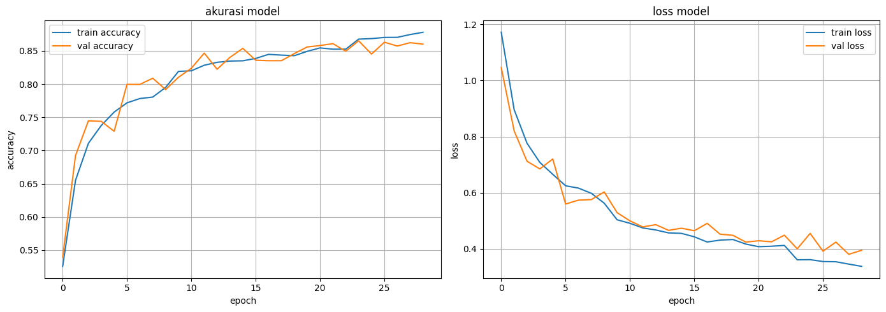
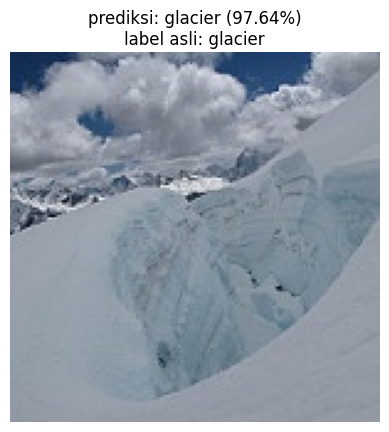

# Image Classification using TensorFlow

A Convolutional Neural Network (CNN) project for classifying natural scene images into six categories using TensorFlow and Keras.

---

## Overview

This project implements an end-to-end image classification pipeline using TensorFlow.

The model is trained on the Intel Image Classification dataset and exported into multiple deployment formats for desktop, mobile, and web deployment.

---

## Dataset

**Classes**

- Buildings
- Forest
- Glacier
- Mountain
- Sea
- Street

---

## Features

- CNN-based image classification
- Data augmentation
- Model evaluation
- Training history visualization
- TensorFlow SavedModel export
- TensorFlow Lite (TFLite) export
- TensorFlow.js export
- Sample image prediction

---

## Project Structure

```text
image-classification-tensorflow/
├── assets/
│   ├── training-history.png
│   └── sample-prediction.png
├── images/
├── models/
│   ├── saved_model/
│   ├── tfjs_model/
│   └── tflite/
├── notebook.ipynb
├── requirements.txt
└── README.md
```

---

## Model Performance

| Metric | Value |
|--------|--------:|
| Test Accuracy | **88.00%** |
| Test Loss | **0.3406** |

The model was evaluated on the Intel Image Classification test dataset.

### Training History



---

## Sample Prediction

Prediction Result:

- **Predicted Class:** Glacier
- **Confidence:** **97.64%**



---

## Model Architecture

The CNN architecture consists of:

- 4 Convolutional layers
- Max Pooling layers
- Flatten layer
- Dense (512 neurons, ReLU)
- Dropout (0.3)
- Softmax output layer (6 classes)

---

## Exported Models

| Format | Description |
|--------|-------------|
| TensorFlow SavedModel | TensorFlow deployment |
| TensorFlow Lite (.tflite) | Mobile & Edge deployment |
| TensorFlow.js | Browser inference |

---

## Technologies

- Python
- TensorFlow
- Keras
- NumPy
- Matplotlib

---

## Future Improvements

- Improve classification accuracy
- Apply Transfer Learning (MobileNetV2 / EfficientNet)
- Hyperparameter tuning
- Web deployment using TensorFlow.js
- Android deployment using TensorFlow Lite

---

## Author

**Miqdad Badjuber**

GitHub: https://github.com/miqdadbadjuber
